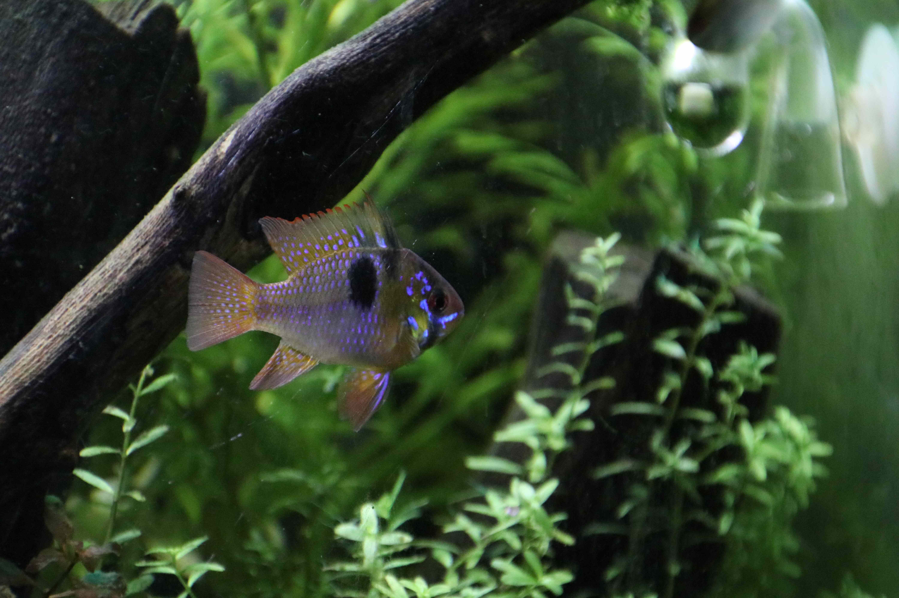
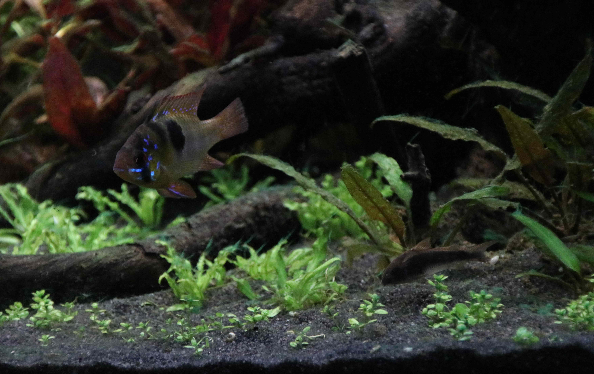
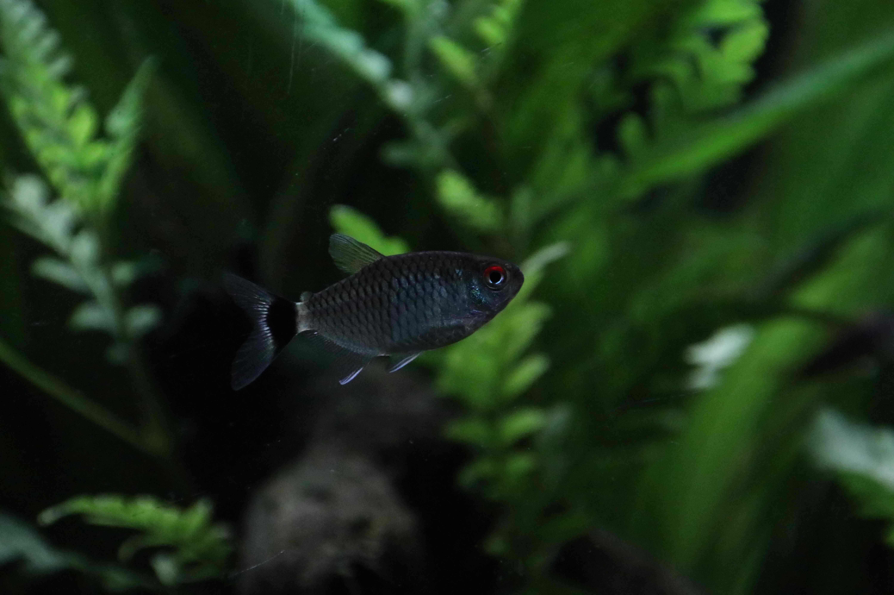

# 80cm Tank December 2020

||
|---|
|120 Liter Tank after adding a few new plants|

||
|---|
|View from the side|

||
|---|
|View from the front|

||
|---|
|German Blue Ram (Male)|

||
|---|
|German Blue Ram and a Bronze Cory|

||
|---|
|Bronze Corydoras with Red Eye Tetras|

||
|---|
|Red Eye Tetra|

||
|---|
|Red Eye Tetras|

||
|---|
|Red Eye Tetras|

 

