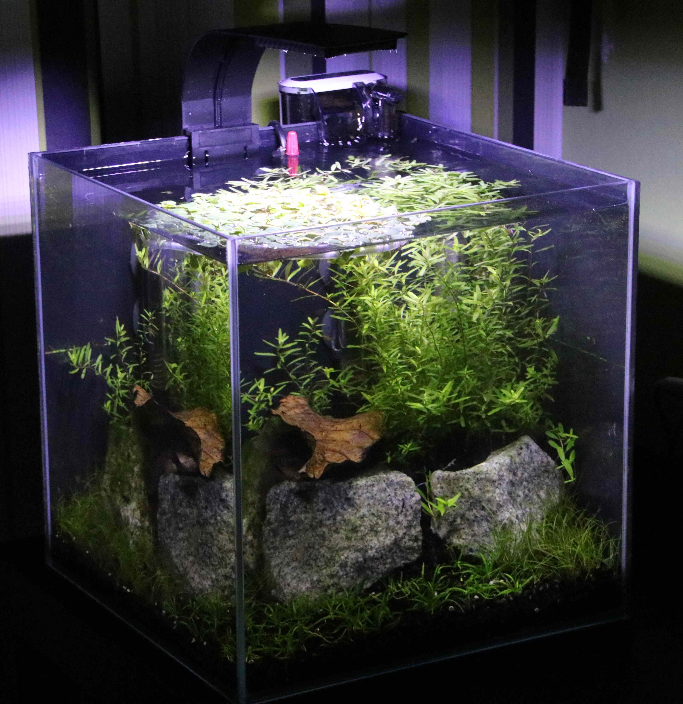
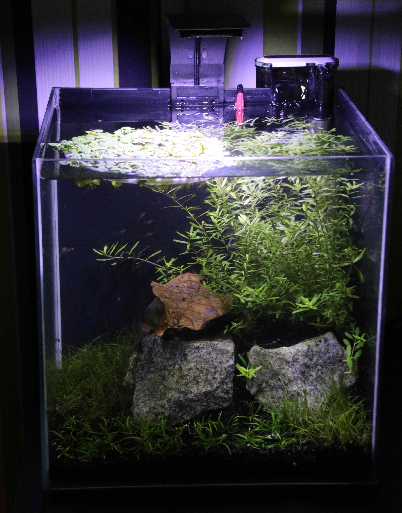
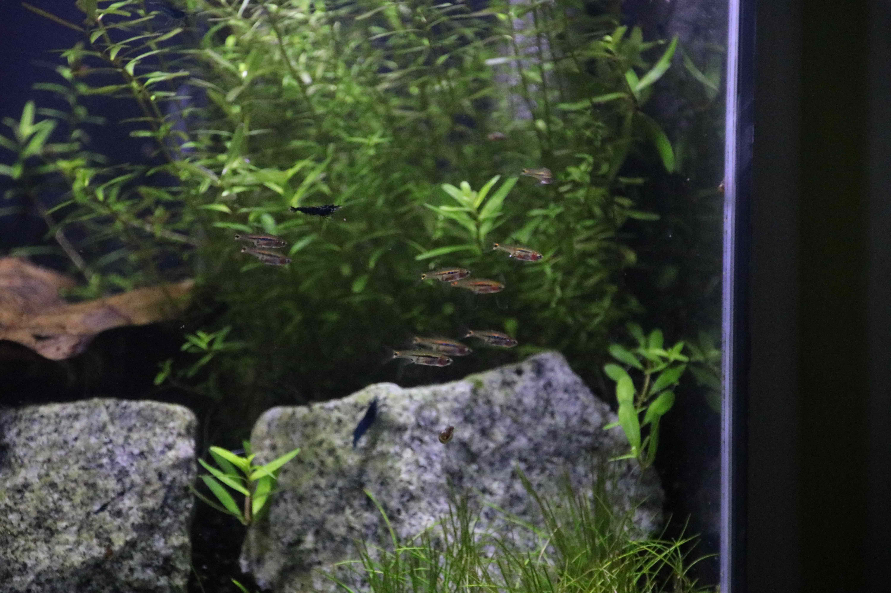
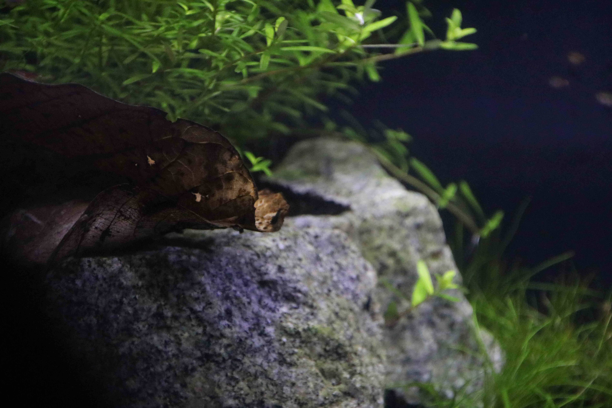
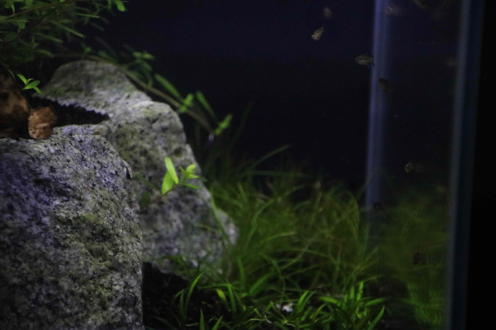
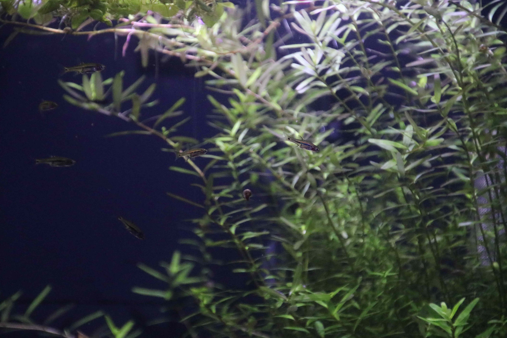
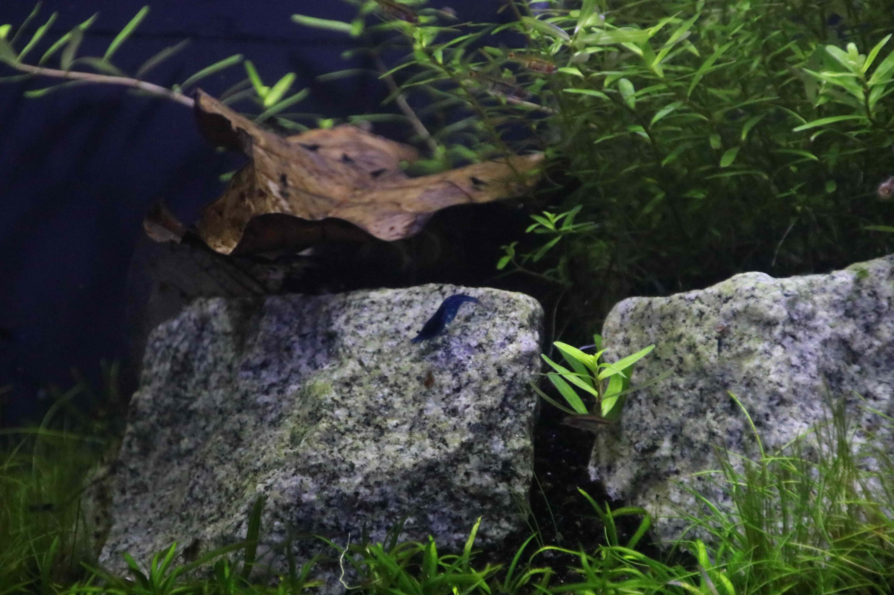

# Nano Tank April 2021

||
|---|
|Nano Tank after the first few weeks |

||
|---|
|View from a different angle

||
|---|
|View from the front|

||
|---|
|Exclamation Point Rasboras and Blue Dream Shrimp|

||
|---|
|Closeup view on a leaf|

||
|---|
|Closeup view with rasboras|

||
|---|
|Floating rasboras|

||
|---|
|Big shrimp|

 

