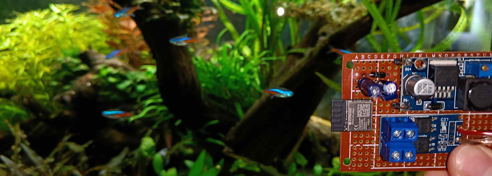

<h4 style="font-size:1.5em;margin-bottom:0.5em"> Welcome to my personal web page!</h4> 

My name is Loris and I study Computer Engineering. 
Not only because of that am I interested in various topics around computers and electronics.

In my freetime I sometimes work on smaller hardware and software [projects](#/pages/projects/readme.html).
As a result I built this small page to display some of them. 
However, not all of my projects make it to this page.
I typically get ideas of what I want to build next when spending time on my other hobbies.

As you can see in some of my projects, I like to keep fish and the idea of aquascaping.
When I'm on the move, I'm probably snowboarding in the mountains with friends or family.
Of course taking [pictures](#/pages/gallery/readme.html) is a part of these activities.

If you've read this far, you can as well leave me a message and tell me what you think about this little page.

- <a href="https://linkedin.com/in/loris-mundry">LinkedIn</a>
- [GitHub](https://github.com/lm4552) 